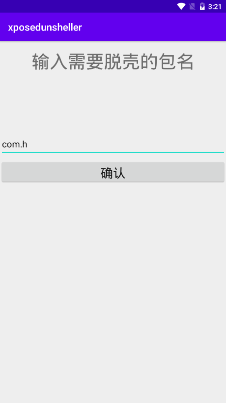
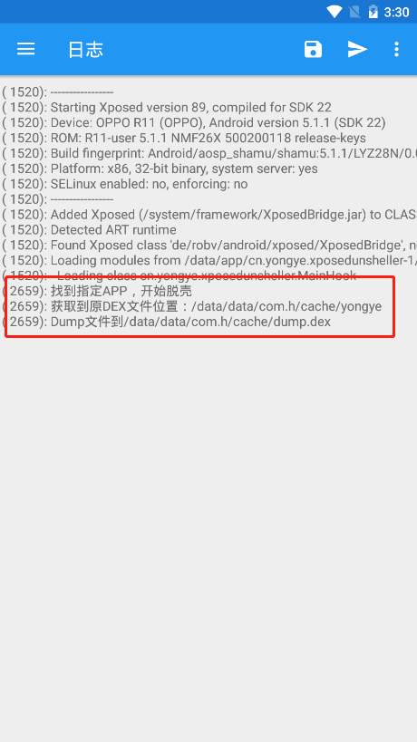
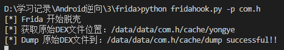

# 概况

本仓库存在Frida和Xposed插件，实现对文件落地型DEX加密保护的App进行自动化脱壳

# 原理

针对文件加载DEX的加固技术，用Java层HOOK DexClassloader构造方法，提取第一个参数对应的原DEX地址即可

# 实现

## Xposed

### 使用

下面是脱文件落地型一代壳的xposed插件使用以及实现过程

1.Root环境下安装xposedinstaller

2.安装脱壳插件，重启系统等待插件生效，在插件App中输入需要脱壳App的包名



3.启动需要脱壳的App开始脱壳，xposedinstaller日志中有dump下的位置



### 插件开发过程

1. 编译[XposedInstaller](https://github.com/rovo89/XposedInstaller)源码，生成Xposed Installer App用加载插件
2. 编译[XposedBridge](https://github.com/rovo89/XposedBridge)，并用**Android Stduio 右侧的Gradle->generateAPI**来在build/api目录下生成用来开发插件的api.jar库
3. 插件开发

编写插件主窗体获取需要脱壳的App包名

```xml
    <uses-permission android:name="android.permission.WRITE_EXTERNAL_STORAGE" />
    <uses-permission android:name="android.permission.READ_EXTERNAL_STORAGE"/>
```

```java
public class MainActivity extends AppCompatActivity implements View.OnClickListener {
    String stConfigFp = null;
    String stPkgName = null;
    EditText pkgEdittext = null;

    @Override
    protected void onCreate(Bundle savedInstanceState) {
        super.onCreate(savedInstanceState);
        setContentView(R.layout.activity_main);

        stConfigFp = "pkgname";
        pkgEdittext = findViewById(R.id.packageEdit);

        Button verifyButton = findViewById(R.id.verifyButton);
        verifyButton.setOnClickListener(this);
    }

    @Override
    public void onClick(View v) {
        try {
            stPkgName = pkgEdittext.getText().toString();
            FileOutputStream out = openFileOutput(stConfigFp, MODE_WORLD_READABLE);
            out.write(stPkgName.getBytes());
            out.close();
            Toast.makeText(MainActivity.this, "包名为：" + stPkgName + "", Toast.LENGTH_LONG).show();
        } catch (FileNotFoundException e) {
            e.printStackTrace();
        } catch (IOException e) {
            e.printStackTrace();
        }
    }
}
```

插件代码,hook DexClassLoader构造方法来获取参数1中的原DEX文件位置

```java
public class MainHook implements IXposedHookLoadPackage {


    @RequiresApi(api = Build.VERSION_CODES.KITKAT)
    @Override
    public void handleLoadPackage(final XC_LoadPackage.LoadPackageParam loadPackageParam) throws Throwable {

        String stCfgFp = "/data/data/cn.yongye.xposedunsheller/files/pkgname";
        String stUnpackPkgNa = FileUtils.getContent(stCfgFp).trim();
        if(loadPackageParam.packageName.contentEquals(stUnpackPkgNa)){

            Class clsDexClassLoader = loadPackageParam.classLoader.loadClass("dalvik.system.DexClassLoader");

            XposedHelpers.findAndHookConstructor(clsDexClassLoader, String.class, String.class, String.class, ClassLoader.class, new XC_MethodHook() {
                @Override
                protected void beforeHookedMethod(MethodHookParam param) throws Throwable {
                    super.beforeHookedMethod(param);
                    String stCfgFp = "/data/data/cn.yongye.xposedunsheller/files/pkgname";
                    String stUnpackPkgNa = FileUtils.getContent(stCfgFp).trim();
                    if(loadPackageParam.packageName.contentEquals(stUnpackPkgNa)){
                        XposedBridge.log("找到指定APP，开始脱壳");
                        XposedBridge.log("获取到原DEX文件位置：" + param.args[0]);
                        String stDumpFp = "/data/data/" + loadPackageParam.packageName + "/cache/dump.dex";
                        XposedBridge.log("Dump文件到" + stDumpFp);
                        FileUtils.cpFile((String) param.args[0], stDumpFp);
                    }
                }
                @Override
                protected void afterHookedMethod(MethodHookParam param) throws Throwable {
                    super.afterHookedMethod(param);

                }
            });
        }
    }
}
```

## Frida

Frida我们采用了python脚本编写frida hook功能，只需要给需要脱壳的apk包名参数即可

### 使用

1.模拟器启动frida-server客户端（ROOT）

2.`python fridahook.py -p <package name>`



### 脱壳脚本开发过程

JavaScript代码：hook DexClassLoader构造方法

```python
def getJSCode(pkgname):
    stJSCode = '''
    Java.perform(function () {
        var dexClassLoader = Java.use('dalvik.system.DexClassLoader');
        dexClassLoader.$init.overload('java.lang.String', 'java.lang.String', 'java.lang.String', 'java.lang.ClassLoader').implementation = function(srcDexFp, libFp, libSearchFp, PClassLoader){
            console.log('[*] Frida 开始脱壳');
            console.log('[*] 获取原始DEX文件位置：' + srcDexFp);

            var stDumpFp = "/data/data/''' + pkgname + '''/cache/dump";
            var FileOutputStream = Java.use("java.io.FileOutputStream");
            var FileInputStream = Java.use("java.io.FileInputStream");
            var fin = FileInputStream.$new(srcDexFp);
            var fout = FileOutputStream.$new(stDumpFp);
            
            var btTmp = Java.array('byte', [0x00]);
            var fret = 0;
            while((fret = fin.read(btTmp, 0, 1)) != -1){
                fout.write(btTmp, 0, 1);
            }
            console.log('[*] Dump 原始DEX文件到：' + stDumpFp + ' successful!!');
            return this.$init(srcDexFp, libFp, libSearchFp, PClassLoader)
        };
    });
    '''
    return stJSCode
```

# Issues

【1】xposed installer下载sdk 过慢，怎么解决?

手动下载从http://dl-xda.xposed.info/framework/ 里选择适合自己机器的sdk包，手动传到`/data/media/0/Android/data/de.robv.android.xposed.installer/cache/downloads/framework/xposed-v89-sdk22-x86.zip`(Android5.1->level22对应的存放位置)